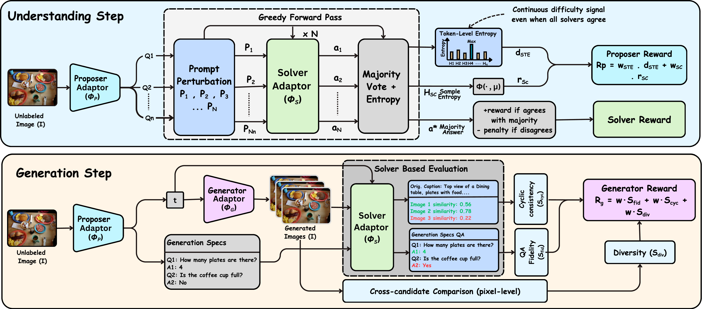
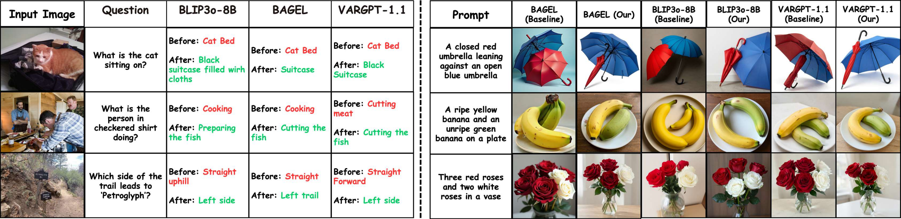

<h1 align="center">
Ask, Solve, Generate: Self-Evolving Unified Multimodal Understanding and Generation via Self-Consistency Rewards
</h1>

<p align="center">
  
  <a href="https://riteshthawkar.github.io/self-evolving-uug/"></a>
  <a href="https://huggingface.co/collections/Ritesh-hf/ask-solve-generate-paper-models"></a>
  <a href="LICENSE"></a>
  <a href="https://pytorch.org/"></a>
</p>

<p align="center">
  Ritesh Thawkar<sup>1</sup> · Shravan Venkatraman<sup>1</sup> · Omkar Thawakar<sup>1</sup> · Abdelrahman M Shaker<sup>1</sup> ·
  Fahad Shahbaz Khan<sup>1,3</sup> · Hisham Cholakkal<sup>1</sup> · Salman Khan<sup>1</sup> · Rao Muhammad Anwer<sup>1,2</sup>
</p>

<p align="center">
  <sup>1</sup> Mohamed bin Zayed University of Artificial Intelligence &nbsp;&nbsp;
  <sup>2</sup> Aalto University &nbsp;&nbsp;
  <sup>3</sup> Link&ouml;ping University
</p>

---

**Ask, Solve, Generate** studies whether unified multimodal models can improve
visual understanding and image generation from unlabeled images alone. The
training loop turns each image into self-generated questions, selects reliable
reference answers through self-consistency, and uses the same interaction signal
to update both understanding and generation components.

---

## 🔎 Overview

The self-evolving loop uses three internal roles:

| Role | Purpose |
| --- | --- |
| Proposer | Generates visual questions from an unlabeled image |
| Solver | Answers and scores candidate questions through self-consistency |
| Generator | Produces images from question-answer-derived generation specs |

The implementation uses internal consistency signals rather than external answer
labels. For understanding, Solver Token Entropy (STE) provides a token-level
uncertainty signal for selecting useful updates. For generation,
question-answer fidelity and cycle-consistent captioning connect generated
images back to the understanding loop.

The main implementation is built around BLIP3o. BAGEL and VARGPT-v1.1
integrations are included to evaluate the same self-evolving recipe on different
unified model families. The released code covers self-questioning,
reference-answer selection, generation supervision, cycle consistency, and
backend-specific training/evaluation adapters.

---

## 🏗️ Architecture

<p align="center">
  
</p>

The framework alternates understanding and generation steps. In the
understanding step, the Proposer creates image-grounded questions, the Solver
answers perturbed prompts, and self-consistency plus token-level entropy provide
training signals. In the generation step, question-answer-derived generation
specifications guide image synthesis, while the Solver evaluates QA fidelity and
cycle consistency.

---

## 📊 Main Results

Results are reported as base checkpoint -> self-evolved checkpoint under
matched evaluation settings. MME-P and MME-C use the raw MME perception and
cognition scores; other understanding metrics are percentages.

### 🧠 Visual Understanding

| Backbone | MMMU | MMBench | TextVQA | SEED | RWQA | MMVet | MME-P | MME-C |
| --- | ---: | ---: | ---: | ---: | ---: | ---: | ---: | ---: |
| BLIP3o-8B | 50.6 -> 52.8 | 83.5 -> 86.1 | 83.1 -> 85.2 | 77.5 -> 79.4 | 69.0 -> 70.9 | 66.6 -> 68.7 | 1682.6 -> 1698.4 | 647.1 -> 660.3 |
| BAGEL | 55.3 -> 58.8 | 85.0 -> 87.1 | 86.0 -> 88.5 | 79.3 -> 81.8 | 71.2 -> 73.9 | 67.2 -> 69.5 | 1687.0 -> 1701.7 | 701.0 -> 715.9 |
| VARGPT-v1.1 | 48.6 -> 51.6 | 81.0 -> 83.7 | 82.0 -> 84.8 | 76.1 -> 79.2 | 67.5 -> 71.1 | 51.9 -> 54.0 | 1678.3 -> 1695.7 | 592.9 -> 606.4 |

### 🎨 Image Generation

GenEval scores are percentages.

| Backbone | Single Obj. | Two Obj. | Counting | Colors | Position | Color Attr. | Overall |
| --- | ---: | ---: | ---: | ---: | ---: | ---: | ---: |
| BLIP3o-8B | 100 -> 99 | 85 -> 93 | 63 -> 71 | 92 -> 94 | 90 -> 90 | 74 -> 75 | 84 -> 87 |
| BAGEL | 99 -> 99 | 94 -> 95 | 81 -> 87 | 88 -> 90 | 64 -> 67 | 63 -> 72 | 82 -> 85 |
| VARGPT-v1.1 | 96 -> 97 | 53 -> 59 | 48 -> 56 | 83 -> 85 | 13 -> 15 | 21 -> 24 | 53 -> 56 |

### 🖼️ Qualitative Results

<p align="center">
  
</p>

---

## 🗂️ Repository Layout

| Path | Purpose |
| --- | --- |
| `BLIP3o/` | BLIP3o training, inference, and evaluation code |
| `Bagel/` | BAGEL baseline integration and self-evolving launchers |
| `vargpt_1_1/` | VARGPT-v1.1 baseline integration and self-evolving launchers |
| `scripts/` | BLIP3o experiment launchers and release utilities |
| `.env.example` | Template for local secrets and cache paths |

Generated outputs are ignored by git. Keep datasets, model weights,
checkpoints, logs, and caches outside the tracked source tree or under ignored
paths such as `data/`, `models/`, `outputs/`, and `logs/`.

---

## ⚙️ Setup

Use separate environments for the three backends. The dependency stacks differ,
and mixing them in one environment can create version conflicts.

Copy `.env.example` to `.env` for local secrets and cache paths. Common keys are
`HF_TOKEN`, `OPENAI_API_KEY`, `WANDB_API_KEY`, and `HF_HOME`; do not commit
filled environment files.

### 🔧 BLIP3o

Install a PyTorch build that matches your CUDA or ROCm stack first, then install
the BLIP3o dependencies and local packages:

```bash
conda create -n uug-blip3o python=3.10 -y
conda activate uug-blip3o
# Install torch/torchvision/torchaudio for your CUDA or ROCm stack first.
pip install -r BLIP3o/requirements.safe.txt
pip install -e BLIP3o
pip install -e BLIP3o/eval/lmms-eval
```

`BLIP3o/requirements.safe.txt` intentionally avoids reinstalling PyTorch,
`xformers`, `flash-attn`, `deepspeed`, and `bitsandbytes`. If you want the
full upstream CUDA stack instead, use:

```bash
pip install -r BLIP3o/requirements.txt
pip install -e BLIP3o
pip install -e BLIP3o/eval/lmms-eval
```

### 🔧 BAGEL

```bash
conda create -n uug-bagel python=3.10 -y
conda activate uug-bagel
pip install -r Bagel/requirements.txt
```

Generation benchmark scoring may also require benchmark-specific detector
assets and setup from `Bagel/EVAL.md`.

### 🔧 VARGPT-v1.1

```bash
conda create -n uug-vargpt python=3.10 -y
conda activate uug-vargpt
cd vargpt_1_1/VARGPT-family-training
pip install -r requirements.txt
pip install -e .
cd ../..
```

For VARGPT understanding evaluation, install the local evaluation package when
needed:

```bash
pip install -e vargpt_1_1/understand_eval
```

The standalone upstream inference examples under `vargpt_1_1/inference_v1_1`
use `vargpt_1_1/requirements.txt`, which pins a PyTorch/flash-attn stack. Use
that file in a separate environment if it conflicts with the training setup.

---

## 🚀 Quick Start

After installing the BLIP3o environment, run a small launcher smoke test on any
local folder of images:

```bash
cp .env.example .env

TOTAL_STEPS=20 \
ALLOW_SMALL_DATA=1 \
DATA_DIR=/path/to/small/image/folder \
OUTPUT_DIR=$PWD/outputs/smoke/blip3o \
bash scripts/E1_main_joint.sh
```

---

## 🤗 Model Zoo

Released checkpoints are available in the
[Ask, Solve, Generate Hugging Face collection](https://huggingface.co/collections/Ritesh-hf/ask-solve-generate-paper-models).
The training and evaluation scripts expect local checkpoint paths.

| Backend | Checkpoint status | Notes |
| --- | --- | --- |
| BLIP3o | [Released](https://huggingface.co/collections/Ritesh-hf/ask-solve-generate-paper-models) | Main implementation for self-evolving unified training |
| BAGEL | [Released](https://huggingface.co/collections/Ritesh-hf/ask-solve-generate-paper-models) | Baseline integration for the same training recipe |
| VARGPT-v1.1 | [Released](https://huggingface.co/collections/Ritesh-hf/ask-solve-generate-paper-models) | 7B+2B baseline integration |

---

## 🔮 Inference

Use these entry points for qualitative checks:

```bash
python BLIP3o/gradio/app.py /path/to/BLIP3o-Model-8B
python BLIP3o/inference.py /path/to/BLIP3o-Model-8B
python vargpt_1_1/inference_v1_1/understanding_vargpt_v1_1.py
python vargpt_1_1/inference_v1_1/generation_vargpt_v1_1.py
```

BAGEL inference utilities are exposed through `Bagel/inferencer.py`; use the
benchmark-generation wrappers for batch sampling and scoring.

---

## 🏋️ Training

BLIP3o training launchers are under `scripts/`. BAGEL and VARGPT-v1.1 use their
backend-native launchers, shown below.

Common BLIP3o launchers:

| Script | Purpose |
| --- | --- |
| `scripts/E1_main_joint.sh` | Main joint 3U:2G training run |
| `scripts/E2_understanding_only.sh` | Understanding-only ablation |
| `scripts/E3_generation_only.sh` | Generation-only ablation |
| `scripts/E4_no_dit_rwr.sh` | Joint run without DiT reward-weighted regression |
| `scripts/E5_synthetic_loop.sh` | Generated-only loop control |
| `scripts/E6_single_step.sh` | Generation-centered unified-step ablation |
| `scripts/E7_two_stage.sh` | Understanding stage followed by generation stage |

### ▶️ Direct BLIP3o Launcher

```bash
CUDA_VISIBLE_DEVICES=0,1,2,3,4,5,6,7 \
NPROC_PER_NODE=8 \
DATA_DIR=/path/to/unlabeled/images \
OUTPUT_DIR=$PWD/outputs/blip3o/E1_main_joint \
bash scripts/E1_main_joint.sh
```

### ▶️ BAGEL Launcher

```bash
MODEL_PATH=/path/to/BAGEL-7B-MoT \
DATA_DIR=/path/to/unlabeled/images \
OUTPUT_DIR=$PWD/outputs/bagel/B1_unified_training \
NPROC_PER_NODE=8 \
bash Bagel/scripts/B1_unified_training.sh
```

`MODEL_PATH` must point to the local BAGEL model checkout or checkpoint
directory.

### ▶️ VARGPT-v1.1 Launcher

```bash
cd vargpt_1_1/VARGPT-family-training

IMAGE_FOLDER=/path/to/unlabeled/images \
OUTPUT_DIR=/path/to/output/vargpt/joint \
bash examples/train_self_evolving/run_self_evolving.sh joint 8
```

Available VARGPT modes are `joint`, `u_only`, and `gen_only`.

For BLIP3o resume, set `RESUME_FROM=/path/to/output_dir` or
`RESUME_FROM=/path/to/output_dir/step_010000`; complete checkpoints contain
`SAVE_OK`. Monitor runs through `status.json`, `iter_log.jsonl`, and
`logs/training_watch.log` inside `OUTPUT_DIR`.

---

## 📏 Evaluation

Use completed checkpoints as input. The exact benchmark data setup follows the
underlying benchmark and upstream evaluation tool requirements.

### 🧠 BLIP3o Understanding

```bash
CHECKPOINT_DIR=/path/to/step_010000 \
NUM_GPUS=8 \
bash BLIP3o/eval/understanding_eval_our.sh
```

Override benchmark tasks when needed:

```bash
CHECKPOINT_DIR=/path/to/step_010000 \
TASKS="realworldqa,textvqa" \
bash BLIP3o/eval/understanding_eval_our.sh
```

### 🎨 BLIP3o Generation

```bash
CHECKPOINT_DIR=/path/to/step_010000 \
bash BLIP3o/eval/geneval/generation_our.sh

CHECKPOINT_DIR=/path/to/step_010000 \
bash BLIP3o/eval/dpg_bench/generate_dpg_our.sh

CHECKPOINT_DIR=/path/to/step_010000 \
bash BLIP3o/eval/wise/generate_wise_our.sh
```

WISE scoring requires `OPENAI_API_KEY`.

### 📋 BAGEL Evaluation

Understanding benchmarks are launched through the BAGEL VLM evaluation
dispatcher:

```bash
bash Bagel/eval/vlm/evaluate.sh mmbench-dev-en
bash Bagel/eval/vlm/evaluate.sh mmmu-val
bash Bagel/eval/vlm/evaluate.sh mme
```

For generation benchmarks, follow the dependency and detector setup described
in `Bagel/EVAL.md`.

### 📋 VARGPT-v1.1 Evaluation

```bash
CHECKPOINT_DIR=/path/to/se_checkpoint_10000 \
NUM_GPUS=8 \
bash vargpt_1_1/understand_eval/understanding_eval_our.sh
```

Generation evaluation wrappers are under:

```text
vargpt_1_1/VARGPT-family-training/run_scripts/
```

For trained checkpoints, start with:

```bash
cd vargpt_1_1/VARGPT-family-training

CHECKPOINT_DIR=/path/to/se_checkpoint_10000 \
bash run_scripts/run_eval_vargpt_generation_our.sh
```

---

## 📚 Citation

If this codebase is useful for your research, please cite:

```bibtex
@misc{thawkar2026asksolvegenerate,
  title = {Ask, Solve, Generate: Self-Evolving Unified Multimodal Understanding and Generation via Self-Consistency Rewards},
  author = {Thawkar, Ritesh and Venkatraman, Shravan and Thawakar, Omkar and Shaker, Abdelrahman M and Khan, Fahad Shahbaz and Cholakkal, Hisham and Khan, Salman and Anwer, Rao Muhammad},
  year = {2026},
  note = {Manuscript}
}
```

---

## 🙏 Acknowledgements

This repository builds on BLIP3o, BAGEL, VARGPT-v1.1, lmms-eval, GenEval,
DPG-Bench, and WISE evaluation tooling. We thank the authors and maintainers of
these projects for releasing their code and models.

---

## 📄 License

This repository is released under the Apache License 2.0. See `LICENSE`.

Third-party code and model integrations under `Bagel/`, `BLIP3o/`, and
`vargpt_1_1/` may retain their upstream licenses and usage terms. Check the
corresponding upstream projects and model cards before redistributing model
weights or derived checkpoints.
